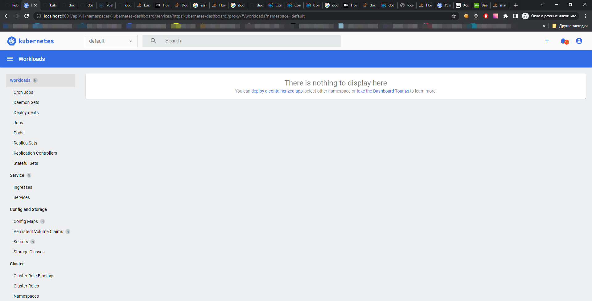

# Task 1.1

## Verify kubectl installation

```cmd
D:\k8s>kubectl version --client
Client Version: version.Info{Major:"1", Minor:"22", GitVersion:"v1.22.4", GitCommit:"b695d79d4f967c403a96986f1750a35eb75e75f1", GitTreeState:"clean", BuildDate:"2021-11-17T15:48:33Z", GoVersion:"go1.16.10", Compiler:"gc", Platform:"windows/amd64"}
```

## Setup autocomplete for kubectl

Not available on windows machine, requires bash/zsh

## Get information about cluster

```cmd
D:\k8s>kubectl cluster-info
Kubernetes control plane is running at https://kubernetes.docker.internal:6443
CoreDNS is running at https://kubernetes.docker.internal:6443/api/v1/namespaces/kube-system/services/kube-dns:dns/proxy

To further debug and diagnose cluster problems, use 'kubectl cluster-info dump'.
```

## get information about available nodes

```cmd
D:\k8s>kubectl get nodes
NAME             STATUS   ROLES                  AGE   VERSION
docker-desktop   Ready    control-plane,master   15d   v1.22.4
```

# Install [Kubernetes Dashboard](https://kubernetes.io/docs/tasks/access-application-cluster/web-ui-dashboard/)

```cmd
D:\k8s>kubectl apply -f https://raw.githubusercontent.com/kubernetes/dashboard/v2.3.1/aio/deploy/recommended.yaml
namespace/kubernetes-dashboard created
serviceaccount/kubernetes-dashboard created
service/kubernetes-dashboard created
secret/kubernetes-dashboard-certs created
secret/kubernetes-dashboard-csrf created
secret/kubernetes-dashboard-key-holder created
configmap/kubernetes-dashboard-settings created
role.rbac.authorization.k8s.io/kubernetes-dashboard created
clusterrole.rbac.authorization.k8s.io/kubernetes-dashboard created
rolebinding.rbac.authorization.k8s.io/kubernetes-dashboard created
clusterrolebinding.rbac.authorization.k8s.io/kubernetes-dashboard created
deployment.apps/kubernetes-dashboard created
service/dashboard-metrics-scraper created
Warning: spec.template.metadata.annotations[seccomp.security.alpha.kubernetes.io/pod]: deprecated since v1.19; use the "seccompProfile" field instead
deployment.apps/dashboard-metrics-scraper created
```

# Check kubernetes-dashboard ns

```cmd
D:\k8s> kubectl get pod -n kubernetes-dashboard
NAME                                         READY   STATUS    RESTARTS   AGE
dashboard-metrics-scraper-856586f554-qgrzs   1/1     Running   0          44s
kubernetes-dashboard-67484c44f6-kcqsm        1/1     Running   0          44s
```

# Install [Metrics Server](https://github.com/kubernetes-sigs/metrics-server#deployment)

```cmd
D:\k8s>kubectl apply -f https://github.com/kubernetes-sigs/metrics-server/releases/latest/download/components.yaml
serviceaccount/metrics-server created
clusterrole.rbac.authorization.k8s.io/system:aggregated-metrics-reader created
clusterrole.rbac.authorization.k8s.io/system:metrics-server created
rolebinding.rbac.authorization.k8s.io/metrics-server-auth-reader created
clusterrolebinding.rbac.authorization.k8s.io/metrics-server:system:auth-delegator created
clusterrolebinding.rbac.authorization.k8s.io/system:metrics-server created
service/metrics-server created
deployment.apps/metrics-server created
apiservice.apiregistration.k8s.io/v1beta1.metrics.k8s.io created
```

## Update deployment

```cmd
D:\k8s>kubectl edit -n kube-system deployment metrics-server
deployment.apps/metrics-server edited
```

# Connect to Dashboard

## Get token

```cmd
D:\k8s>kubectl describe sa -n kube-system default
Name:                default
Namespace:           kube-system
Labels:              <none>
Annotations:         <none>
Image pull secrets:  <none>
Mountable secrets:   default-token-xmf8z
Tokens:              default-token-xmf8z
Events:              <none>

D:\k8s>kubectl get secrets -n kube-system
NAME                                             TYPE                                  DATA   AGE
attachdetach-controller-token-2drtp              kubernetes.io/service-account-token   3      15d
bootstrap-signer-token-l6qms                     kubernetes.io/service-account-token   3      15d
certificate-controller-token-hdfn6               kubernetes.io/service-account-token   3      15d
clusterrole-aggregation-controller-token-q4cb5   kubernetes.io/service-account-token   3      15d
coredns-token-2wnwh                              kubernetes.io/service-account-token   3      15d
cronjob-controller-token-62wpd                   kubernetes.io/service-account-token   3      15d
daemon-set-controller-token-nm2nq                kubernetes.io/service-account-token   3      15d
default-token-xmf8z                              kubernetes.io/service-account-token   3      15d
deployment-controller-token-dgph5                kubernetes.io/service-account-token   3      15d
disruption-controller-token-dlfxf                kubernetes.io/service-account-token   3      15d
endpoint-controller-token-4cj7d                  kubernetes.io/service-account-token   3      15d
endpointslice-controller-token-q9cpc             kubernetes.io/service-account-token   3      15d
endpointslicemirroring-controller-token-jr8hl    kubernetes.io/service-account-token   3      15d
ephemeral-volume-controller-token-gkwp4          kubernetes.io/service-account-token   3      15d
expand-controller-token-d749n                    kubernetes.io/service-account-token   3      15d
generic-garbage-collector-token-vtf6f            kubernetes.io/service-account-token   3      15d
horizontal-pod-autoscaler-token-tbpkg            kubernetes.io/service-account-token   3      15d
job-controller-token-jjlmv                       kubernetes.io/service-account-token   3      15d
kube-proxy-token-7chb2                           kubernetes.io/service-account-token   3      15d
metrics-server-token-6mnxb                       kubernetes.io/service-account-token   3      26m
namespace-controller-token-hbqh5                 kubernetes.io/service-account-token   3      15d
node-controller-token-dcd2t                      kubernetes.io/service-account-token   3      15d
persistent-volume-binder-token-k5t2j             kubernetes.io/service-account-token   3      15d
pod-garbage-collector-token-wmzxc                kubernetes.io/service-account-token   3      15d
pv-protection-controller-token-d2fpz             kubernetes.io/service-account-token   3      15d
pvc-protection-controller-token-k6768            kubernetes.io/service-account-token   3      15d
replicaset-controller-token-wv2w7                kubernetes.io/service-account-token   3      15d
replication-controller-token-zp7jz               kubernetes.io/service-account-token   3      15d
resourcequota-controller-token-m6gvc             kubernetes.io/service-account-token   3      15d
root-ca-cert-publisher-token-6pllr               kubernetes.io/service-account-token   3      15d
service-account-controller-token-nm9nx           kubernetes.io/service-account-token   3      15d
service-controller-token-2hw84                   kubernetes.io/service-account-token   3      15d
statefulset-controller-token-9pq7r               kubernetes.io/service-account-token   3      15d
storage-provisioner-token-zws5c                  kubernetes.io/service-account-token   3      15d
token-cleaner-token-8lwcz                        kubernetes.io/service-account-token   3      15d
ttl-after-finished-controller-token-h8plw        kubernetes.io/service-account-token   3      15d
ttl-controller-token-lcqbj                       kubernetes.io/service-account-token   3      15d
vpnkit-controller-token-8f9nj                    kubernetes.io/service-account-token   3      15d

D:\k8s>kubectl get secrets -n kube-system default-token-xmf8z -o yaml
apiVersion: v1
data:
  ca.crt: LS0tLS1CRUdJTiBDRVJUSUZJQ0FUR11CnpabzB6OTNONW9SejhMY1U5Yk1Wc2MKS1hzK0JONHR[truncated]LS0tCg==
  namespace: a3[truncated]N0ZW0=
  token: ZXlKaGJHY2lPaUpTVXpJMU5pSXNJbXRwWkNJNkltSXRSR2xPZ[truncated]k3VlBGYXpZUDNfZVdsdkRINi1nTTA5dw==
kind: Secret
metadata:
  annotations:
    kubernetes.io/service-account.name: default
    kubernetes.io/service-account.uid: 57986cf9-c8a2-4bec-8f35-13d9c0117210
  creationTimestamp: "2022-04-20T16:56:22Z"
  name: default-token-xmf8z
  namespace: kube-system
  resourceVersion: "378"
  uid: 53944312-2abe-4cc7-bac4-7036fd724824
type: kubernetes.io/service-account-token

BASE64 decoded token:
eyJhbGciOiJSUzI1Ni[truncated]R6_nrglAKPS1zViw6rRfN49I7VPFazYP3_eWlvDH6-gM09w

```

## Connect to Dashboard

```cmd
D:\k8s>kubectl proxy
Starting to serve on 127.0.0.1:8001
```

In browser connect to http://localhost:8001/api/v1/namespaces/kubernetes-dashboard/services/https:kubernetes-dashboard:/proxy/



# Task 1.2

# Kubernetes resourceas introduction

```cmd
D:\k8s>kubectl run web --image=nginx:latest
pod/web created
```

```cmd
D:\k8s>kubectl get pods
NAME   READY   STATUS    RESTARTS   AGE
web    1/1     Running   0          21s

D:\k8s>docker container ls
CONTAINER ID   IMAGE                          COMMAND                  CREATED          STATUS                  PORTS                    NAMES
3817c19a180d   nginx                          "/docker-entrypoint.…"   45 seconds ago   Up 53 seconds                                    k8s_web_web_default_b5aef116-1309-468c-b122-3576b8b93d01_0
8988865e3892   k8s.gcr.io/pause:3.5           "/pause"                 54 seconds ago   Up About a minute                                k8s_POD_web_default_b5aef116-1309-468c-b122-3576b8b93d01_0
```

Apply manifests (download from repository)

```cmd
D:\k8s>kubectl apply -f pod.yaml
pod/nginx created
D:\k8s>kubectl apply -f rs.yaml
replicaset.apps/webreplica created
```

Look at pod

```cmd
D:\k8s>kubectl get pod
NAME               READY   STATUS    RESTARTS   AGE
nginx              1/1     Running   0          57s
web                1/1     Running   0          18m
webreplica-rc5bd   1/1     Running   0          21s
```

# You can create simple manifest from cmd

```cmd
D:\k8s>kubectl run web --image=nginx:latest --dry-run=client -o yaml
apiVersion: v1
kind: Pod
metadata:
  creationTimestamp: null
  labels:
    run: web
  name: web
spec:
  containers:
  - image: nginx:latest
    name: web
    resources: {}
  dnsPolicy: ClusterFirst
  restartPolicy: Always
status: {}
```

### Homework

- Create a deployment nginx. Set up two replicas. Remove one of the pods, see what happens.

```cmd
D:\k8s>kubectl create deployment nginx --replicas=2 --image=nginx
deployment.apps/nginx created
D:\k8s>kubectl get deployments.apps
NAME    READY   UP-TO-DATE   AVAILABLE   AGE
nginx   2/2     2            2           16s
D:\k8s>kubectl get pods
NAME                     READY   STATUS    RESTARTS   AGE
nginx                    1/1     Running   0          3m39s
nginx-6799fc88d8-f578f   1/1     Running   0          29s
nginx-6799fc88d8-jf589   1/1     Running   0          29s
web                      1/1     Running   0          20m
webreplica-rc5bd         1/1     Running   0          3m3s
kubectl delete pod nginx-6799fc88d8-jf589
pod "nginx-6799fc88d8-jf589" deleted
D:\k8s>kubectl get pods
NAME                     READY   STATUS    RESTARTS   AGE
nginx                    1/1     Running   0          4m35s
nginx-6799fc88d8-f578f   1/1     Running   0          85s
nginx-6799fc88d8-gjc7l   1/1     Running   0          14s
web                      1/1     Running   0          21m
webreplica-rc5bd         1/1     Running   0          3m59s
```
